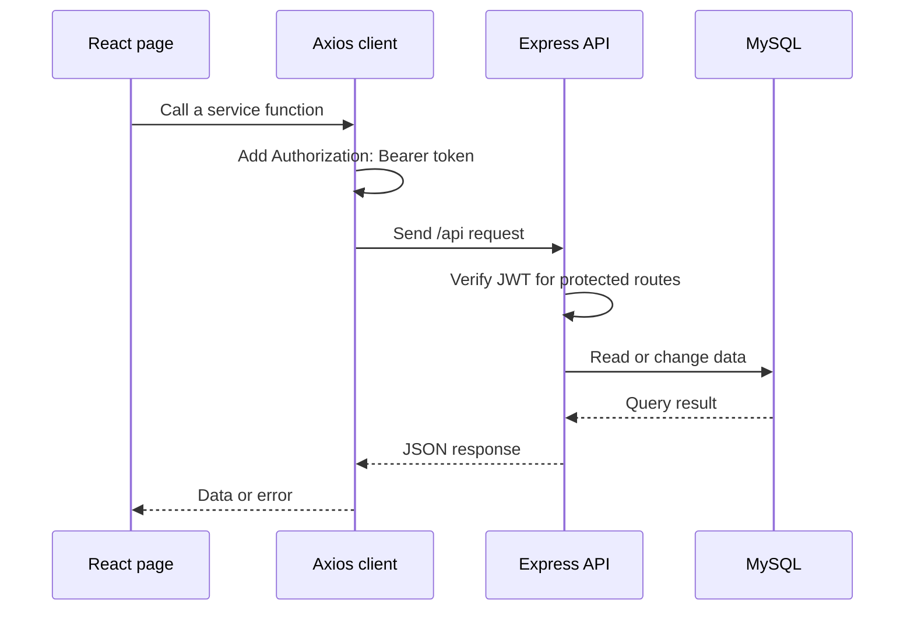
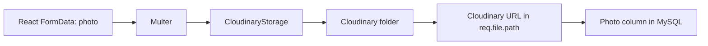
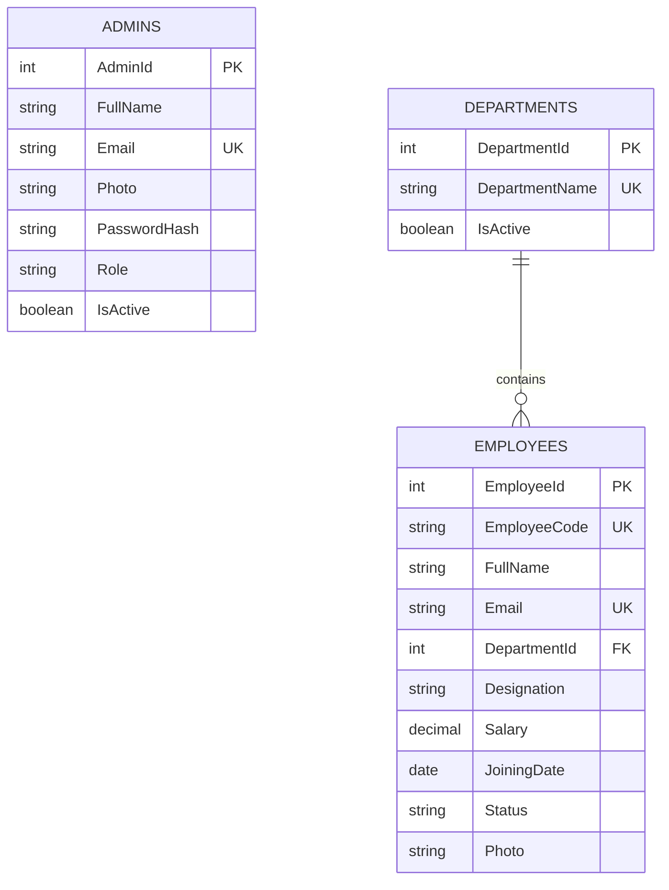

# WorkSphere — Project Documentation

WorkSphere is an admin-facing employee-management application. An administrator can sign in, view dashboard totals, manage employees, and update their own profile and photo.

## 1. Technology at a glance

| Layer | Technology | Responsibility |
| --- | --- | --- |
| Frontend | React 19, Vite, React Router, Redux Toolkit, Tailwind CSS | Screens, navigation, client state, forms and API calls |
| Backend | Node.js, Express | REST API, authentication, validation and business logic |
| Database | MySQL | Admin, department and employee data |
| Image storage | Cloudinary + Multer | Stores employee and profile photos in the cloud |
| Frontend hosting | Vercel | Builds and serves the React application |
| Backend hosting | Render | Runs the Express API |

## 2. Architecture

```mermaid
flowchart LR
    U[Admin in browser] --> F[React + Vite frontend\nVercel or localhost:5173]
    F -->|HTTPS REST requests\nBearer access token| B[Express API\nRender or localhost:5000]
    B -->|SQL queries| D[(MySQL database)]VITE_API_URL=https://worksphere-backend-mts5.onrender.com/api
    B -->|Image upload via Multer| C[Cloudinary]
    C -->|secure image URL| B
    B -->|JSON response + cookie| F
```

### A request through the application



## 3. Repository map

```text
worksphere/
├── frontend/                 React application
│   ├── src/api/              Axios instance and endpoint wrappers
│   ├── src/services/         Page-friendly API functions
│   ├── src/pages/            Login, dashboard, employees and profile screens
│   ├── src/components/       Reusable UI and layout components
│   ├── src/store/            Redux auth, loader and search state
│   └── public/logo.png       Browser favicon source
├── backend/                  Express API
│   ├── routes/               Maps URLs to controllers
│   ├── controllers/          Handles HTTP requests/responses
│   ├── services/             Business logic and database calls
│   ├── sql/                  SQL query strings
│   ├── middleware/           JWT protection and Cloudinary upload handling
│   └── config/               MySQL and Cloudinary configuration
├── database/
│   ├── schema.sql            Creates the database tables
│   └── seed.sql              Adds initial departments
└── DOCUMENTATION.md          This guide
```

## 4. Frontend explained

### Routing

`frontend/src/routes/AppRoutes.jsx` defines the pages:

| URL | Screen | Access |
| --- | --- | --- |
| `/` | Login | Public |
| `/dashboard` | Dashboard totals and recent employees | Signed-in admin |
| `/employees` | Employee list, search/filter/pagination | Signed-in admin |
| `/employees/add` | Add employee | Signed-in admin |
| `/employees/edit/:id` | Edit employee | Signed-in admin |
| `/profile` | Admin profile and password | Signed-in admin |

`ProtectedRoute.jsx` checks Redux's `isAuthenticated` value. When no access token exists, it redirects the user to `/`.

### API client and token refresh

`frontend/src/api/api.js` creates one Axios client.

1. `VITE_API_URL` supplies the API base URL. The local fallback is `http://localhost:5000/api`.
2. Before each request, Axios reads `token` from `localStorage` and adds it as a Bearer token.
3. If a protected request receives `401`, Axios calls `/auth/refresh` once.
4. The refresh token is sent automatically in an HTTP-only cookie. The API returns a new access token, then Axios retries the original request.
5. If refresh fails, browser storage is cleared and the user returns to login.

Redux stores the current `user`, `token`, authentication flag, global loading state and employee search state. Browser storage keeps the session across a refresh.

## 5. Backend explained

The backend follows this path:

```text
Route → middleware → controller → service → SQL query → MySQL
```

- **Routes** define the URL and middleware.
- **Middleware** protects routes with JWTs or processes an uploaded `photo` field.
- **Controllers** translate HTTP requests to service calls and return JSON.
- **Services** contain database and authentication logic.
- **SQL files** keep the query text separate from JavaScript.

### Authentication

1. `POST /api/auth/login` checks the admin email and bcrypt password hash.
2. The backend returns a 30-minute access JWT and admin summary.
3. It puts a 7-day refresh JWT into an HTTP-only `refreshToken` cookie.
4. `verifyToken` checks the Bearer token before protected endpoints run.
5. `POST /api/auth/refresh` validates the cookie and issues another access token.

In production, `NODE_ENV=production` makes the cookie `Secure` and `SameSite=None`, which is required because the Vercel site and Render API use different domains.

### Image uploads

Employee and profile routes accept a multipart form field named `photo`.



The image is limited to 2 MB and must be JPG or PNG. Cloudinary stores the file; MySQL stores its URL. This means the app does not depend on Render's temporary filesystem for images.

## 6. API reference

All URLs below are relative to the API base URL (`/api`). Endpoints marked protected require `Authorization: Bearer <access-token>`.

| Method | Endpoint | Protected | Purpose |
| --- | --- | --- | --- |
| POST | `/auth/register` | No | Create an admin |
| POST | `/auth/login` | No | Sign in and receive access token/cookie |
| POST | `/auth/refresh` | Cookie | Get a new access token |
| GET | `/dashboard` | Yes | Totals and five recent employees |
| GET | `/employees` | Yes | List employees; supports `search`, `department`, `status`, `page`, `limit` |
| GET | `/employees/:id` | Yes | Get one employee |
| POST | `/employees` | Yes | Create employee; optional `photo` upload |
| PUT | `/employees/:id` | Yes | Update employee; optional `photo` upload |
| DELETE | `/employees/:id` | Yes | Delete employee |
| GET | `/departments` | Yes | List departments |
| GET | `/departments/:id` | Yes | Get one department |
| POST | `/departments` | Yes | Create department |
| PUT | `/departments/:id` | Yes | Rename department |
| DELETE | `/departments/:id` | Yes | Delete department |
| GET | `/profile` | Yes | Get signed-in admin profile |
| PUT | `/profile` | Yes | Update profile; optional `photo` upload |
| PUT | `/profile/password` | Yes | Change password |

## 7. Database model



Run `database/schema.sql` first, then `database/seed.sql`. Do not commit database passwords or API keys.

## 8. Environment variables

### Frontend (`frontend/.env` and Vercel)

```env
VITE_API_URL=http://localhost:5000/api
```

For Vercel production:

```env
VITE_API_URL=https://worksphere-backend-mts5.onrender.com/api
```

Vite exposes only variables beginning with `VITE_` to browser code. Restart Vite or redeploy Vercel after changing this value.

### Backend (`backend/.env` and Render)

```env
PORT=5000
DB_HOST=...
DB_PORT=3306
DB_USER=...
DB_PASSWORD=...
DB_NAME=...
JWT_SECRET=...
JWT_REFRESH_SECRET=...
CLOUDINARY_CLOUD_NAME=...
CLOUDINARY_API_KEY=...
CLOUDINARY_API_SECRET=...
CORS_ORIGINS=http://localhost:5173,https://worksphere-tau.vercel.app
NODE_ENV=production
```

`CORS_ORIGINS` is a comma-separated allow-list. It is the single place for approved frontend domains. Do not use `*` when `credentials: true` is enabled; browsers reject wildcard CORS for credentialed requests.

## 9. Run locally

Prerequisites: Node.js, npm, a MySQL database, and Cloudinary credentials.

```bash
# terminal 1
cd backend
npm install
npm run dev

# terminal 2
cd frontend
npm install
npm run dev
```

Open `http://localhost:5173`.

## 10. Deployment checklist

### Render backend

1. Connect the repository and use `backend` as the service root directory.
2. Build command: `npm install`.
3. Start command: `npm start`.
4. Add every backend variable from the backend environment list.
5. Set `NODE_ENV=production` and set both approved origins in `CORS_ORIGINS`.
6. Redeploy after code or environment changes.

### Vercel frontend

1. Import the repository and use `frontend` as the root directory.
2. Framework: Vite; build command: `npm run build`.
3. Add `VITE_API_URL` with the Render URL ending in `/api`.
4. Redeploy after changing any `VITE_` variable.

## 11. Troubleshooting

| Symptom | Likely cause | What to check |
| --- | --- | --- |
| CORS browser error | Request origin is absent from `CORS_ORIGINS` or Render has not redeployed | Exact Vercel/local URL, Render environment and deployment logs |
| `404 /auth/login` | API URL is missing `/api` | `VITE_API_URL` must end in `/api` |
| `401` then login redirect | Access and refresh tokens are expired/invalid | Browser cookies, `JWT_SECRET`, `JWT_REFRESH_SECRET`, `NODE_ENV` |
| `500` on photo upload | Cloudinary variables missing/invalid, unsupported type, or image is too large | Render logs; all three Cloudinary values; JPG/PNG under 2 MB |
| Old frontend configuration | Vite variables are compiled during build | Redeploy Vercel after environment-variable changes |

## 12. Good next improvements

- Add server-side request validation (for example Zod/Joi) for all payloads.
- Add rate limiting to login and refresh routes.
- Delete replaced/deleted Cloudinary images to prevent unused media.
- Use a refresh-token database/deny-list to enable immediate logout from all devices.
- Add automated tests for auth, protected routes and upload validation.
- Use a migration tool for database schema changes instead of editing production tables manually.

